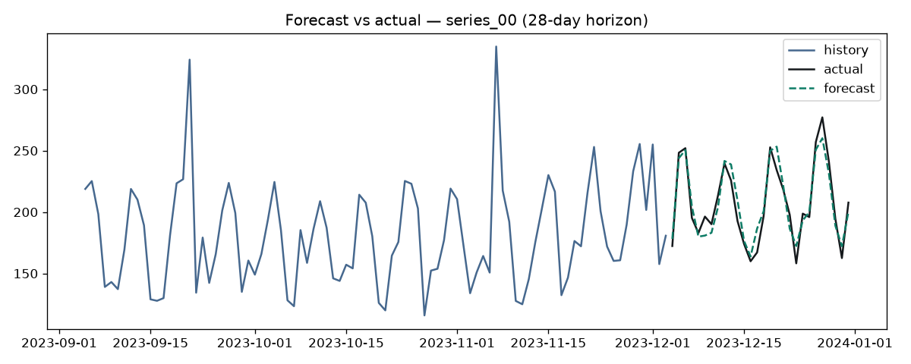
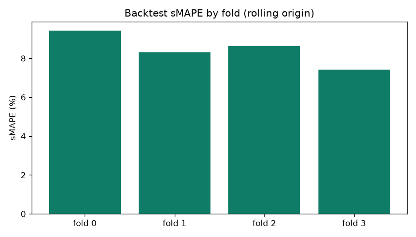
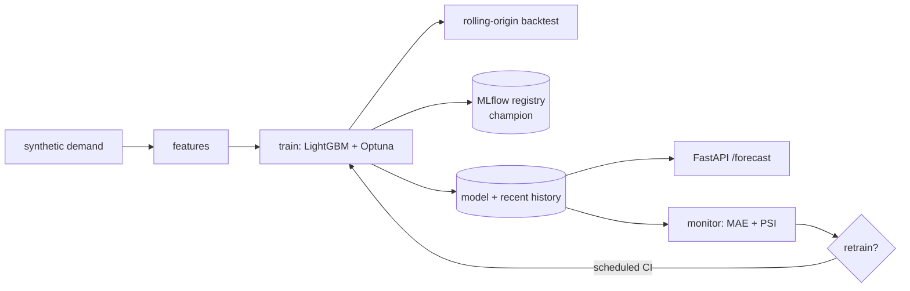

# mlops-demand-forecasting

[](https://github.com/bushra-nazeer/mlops-demand-forecasting/actions/workflows/ci.yml)


Demand forecasting wrapped in a **complete MLOps lifecycle**: rolling-origin
backtesting, **MLflow tracking + model registry**, **scheduled automated
retraining** gated by drift/error monitoring, and a **FastAPI** forecasting
service. A LightGBM recursive forecaster is benchmarked against ETS and
seasonal-naive baselines on a self-contained synthetic demand panel.

> All metrics below are from a real `make train && make evaluate` run.

## Results

LightGBM beats both classical baselines on the held-out horizon (lower sMAPE is better):

| Model | sMAPE | 
|---|---|
| **LightGBM (this repo)** | **6.37%** |
| Holt-Winters ETS | 7.74% |
| Seasonal-naive | 11.23% |

Honest **rolling-origin backtest** (train-to-cutoff → forecast unseen 28 days → repeat over 4 folds):

| Metric | Value |
|---|---|
| MAE | 11.82 |
| RMSE | 19.75 |
| MAPE | 8.27% |
| sMAPE | 8.45% |

| Forecast vs actual | Backtest sMAPE by fold |
|---|---|
|  |  |

## The MLOps lifecycle (what makes this more than a model)

- **Backtesting** (`backtest.py`) — rolling-origin, the honest way to estimate
  forecast error; reported metrics come from here, not in-sample fit.
- **Registry** (`registry.py`) — every model is logged to MLflow (sqlite backend)
  and the new version is aliased **`champion`** in the Model Registry.
- **Monitoring** (`monitor.py`) — compares live forecast MAE to the backtest
  baseline and checks demand drift (PSI). A real run reports:
  `mae_ratio 0.87, demand_psi 0.08 → needs_retrain: false` (healthy).
- **Automated retraining** (`retrain.py` + `.github/workflows/retrain.yml`) — a
  scheduled workflow runs the monitor and retrains/re-registers **only when the
  gate trips**. The closed loop, not just a notebook.

## Modeling

- **Recursive multi-step** LightGBM: one single-step model rolled out to the
  horizon, feeding predictions back as lag features.
- **No train/serve skew** — `features.py` (training) and `forecast.py` (serving)
  produce identical feature columns.
- Features: calendar (day-of-week, month, holidays), lags (1/7/14/28), rolling
  mean/std, promo flag, per-series index.

## Architecture



## Quickstart

```bash
docker compose up --build api          # serve forecasts at http://localhost:8000

make install
make train       # Optuna tune + backtest + register champion in MLflow
make evaluate    # LightGBM vs ETS vs seasonal-naive + plots
make monitor     # live error + drift check -> retrain decision
make retrain     # closed-loop: retrains only if the monitor trips (--force to override)
make serve       # FastAPI
make mlflow-ui   # browse runs + registry at http://localhost:5000
make test        # pytest    |    make lint
```

## Using the API

```bash
curl "localhost:8000/series"
curl "localhost:8000/forecast?series_id=series_00&horizon=7"
```

```json
{
  "series_id": "series_00",
  "horizon": 7,
  "forecast": [
    { "date": "2024-01-01", "prediction": 208.42 },
    { "date": "2024-01-02", "prediction": 262.45 },
    { "date": "2024-01-03", "prediction": 272.64 }
  ]
}
```

## Repository layout

```
src/forecasting/  generator · features · forecast · model · metrics · backtest · baselines
                  train · registry · monitor · retrain · evaluate
src/forecasting/api/   FastAPI /forecast, /series, /health
tests/            generator, features, metrics, forecast, backtest, monitor, API
.github/workflows/   ci.yml (lint+test) · retrain.yml (scheduled retraining)
docs/             architecture diagram + design spec
```

Prophet is supported as an optional classical model: `pip install -e ".[prophet]"`.

## License

[MIT](LICENSE)
