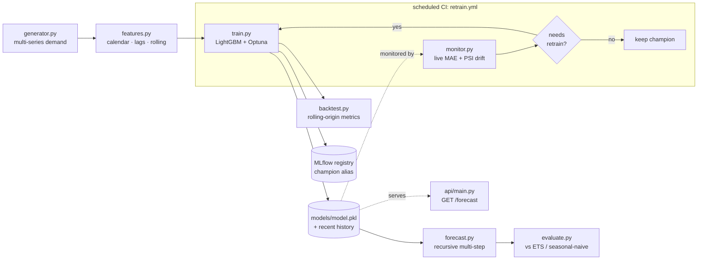

# Architecture

## The MLOps loop

## Why it's structured this way

- **One feature definition, two code paths.** `features.py` builds the training
  matrix (vectorized); `forecast.py` rebuilds the identical columns one step at a
  time for recursive forecasting. Same names, same order — no skew.
- **Honest metrics.** Accuracy comes from `backtest.py` (rolling-origin: train to
  a cutoff, forecast unseen horizon, repeat) — not from fitting and scoring the
  same data.
- **Registry-backed.** A sqlite MLflow backend enables versioning; each model is
  logged and aliased `champion`.
- **Closed loop.** `monitor.py` compares live error to the backtest baseline and
  checks demand drift (PSI); `retrain.py` (run by `retrain.yml` on a schedule)
  retrains only when that gate trips.

## Modules

| Module | Responsibility |
|---|---|
| `generator.py` | Synthetic multi-series demand panel |
| `features.py` | Calendar, lag, rolling features (training side) |
| `forecast.py` | Recursive multi-step forecasting (serving side) |
| `model.py` | LightGBM factory |
| `backtest.py` | Rolling-origin evaluation |
| `baselines.py` | ETS + seasonal-naive (+ optional Prophet) |
| `train.py` | Optuna tuning, fit, backtest, register |
| `registry.py` | MLflow tracking + registry |
| `monitor.py` | Live error + PSI drift → retrain decision |
| `retrain.py` | Closed-loop retraining entrypoint |
| `evaluate.py` | Holdout vs baselines + plots |
| `api/` | FastAPI `/forecast`, `/series`, `/health` |
